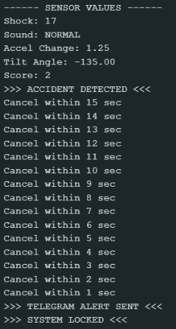

# IoT-Based Intelligent Accident Detection and Emergency Response System

## 📌 Overview
Road accidents are a major cause of injuries and fatalities worldwide. One of the major reasons for increased death rates is the delay in providing medical assistance to victims. In many cases, victims are unconscious or severely injured and unable to call for help. Lack of accurate location details further delays emergency response.

This project presents an **IoT-Based Intelligent Accident Detection and Emergency Response System** that automatically detects accidents using multiple sensors, verifies the event using intelligent logic, and sends emergency alerts with location details through the internet without human intervention.

---

## 🎯 Objectives

The main objective of this project is to improve road safety and reduce emergency response time.

### Specific Objectives
- Automatically detect accidents using multiple sensors  
- Accurately determine the accident location  
- Provide a 10–15 second user confirmation timer to prevent false alerts  
- Automatically send emergency alerts if no user response is received  
- Communicate quickly with predefined contacts or emergency services  
- Improve chances of timely medical assistance and reduce fatalities  

---

# 📂 Chapter 1: Problem Statement

Road accidents often become fatal because emergency help does not arrive on time. Victims may be unable to communicate due to unconsciousness or severe injuries. Manual reporting also delays rescue operations.

An automated smart system is needed to:

- Detect accidents instantly  
- Analyze severity using multiple parameters  
- Share exact location automatically  
- Notify emergency contacts immediately  

This project solves these issues using IoT technology.

---

# 🛠️ Chapter 2: Components Required

## 💻 Software Components

| Component | Description |
|----------|-------------|
| C++ (Arduino IDE) | Used to program ESP8266 and implement accident detection logic |
| Arduino IDE | Development platform for coding, compiling, and uploading |
| ESP8266WiFi.h | Enables WiFi communication |
| WiFiClientSecure.h | Secure HTTPS communication with Telegram API |
| time.h | Fetches real-time timestamp from NTP server |
| Wire.h | I2C communication with MPU6050 |
| MPU6050 Library | Reads acceleration and tilt values |
| Telegram Bot API | Sends alert messages with time and location |

---

## 🔩 Hardware Components

| Component | Description |
|----------|-------------|
| ESP8266 (NodeMCU) | Main controller with WiFi |
| Shock Sensor | Detects collision impact |
| Sound Sensor | Detects crash noise |
| Tilt Sensor | Detects rollover or abnormal tilt |
| MPU6050 | Accelerometer + Gyroscope |
| Push Button | Cancels false alerts |
| LED Indicator | Shows alert/timer status |
| Power Supply / USB Cable | Powers the system |

---

# 📐 Chapter 3: Architecture Diagram

## 🔷 System Architecture

```text
+---------------------------------------------------+
| Shock Sensor                                      |
| Sound Sensor                                      |
| Tilt Sensor                                       |
| MPU6050 (Accelerometer + Gyroscope)               |
+---------------------------------------------------+
                     ↓
            +------------------+
            | ESP8266 NodeMCU  |
            +------------------+
                     ↓
     +--------------------------------+
     | Intelligent Decision Algorithm |
     +--------------------------------+
                     ↓
      +------------------------------+
      | 15-sec Confirmation Timer    |
      +------------------------------+
             ↓                ↓
     If Cancelled        If No Response
         Stop                Send Alert
                                ↓
              Telegram Message + Time + Location

📐 Chapter 4: Flow Chart
🔷 Flow Chart
Start
  ↓
Initialize Sensors & WiFi
  ↓
Read Sensor Values
  ↓
Check Accident Conditions
  ↓
Accident Detected?
 ├── No → Continue Monitoring
 └── Yes
        ↓
 Start 15-sec Timer + LED ON
        ↓
 Check Push Button
        ↓
 Button Pressed?
 ├── Yes → Cancel Alert / Stop
 └── No
        ↓
 Send Telegram Alert
        ↓
 Lock System Until Restart
        ↓
       End
# 🚨 IoT-Based Accident Detection System

## 📌 Architecture Diagram


## ⚙️ Working Model


## 🚗 Accident Detection


## 📩 Alert System


## 🤖 Telegram Bot Integration

