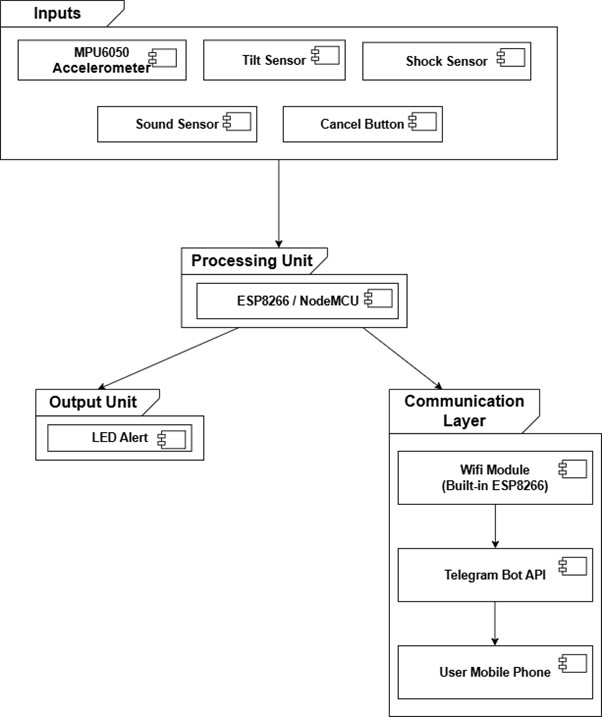
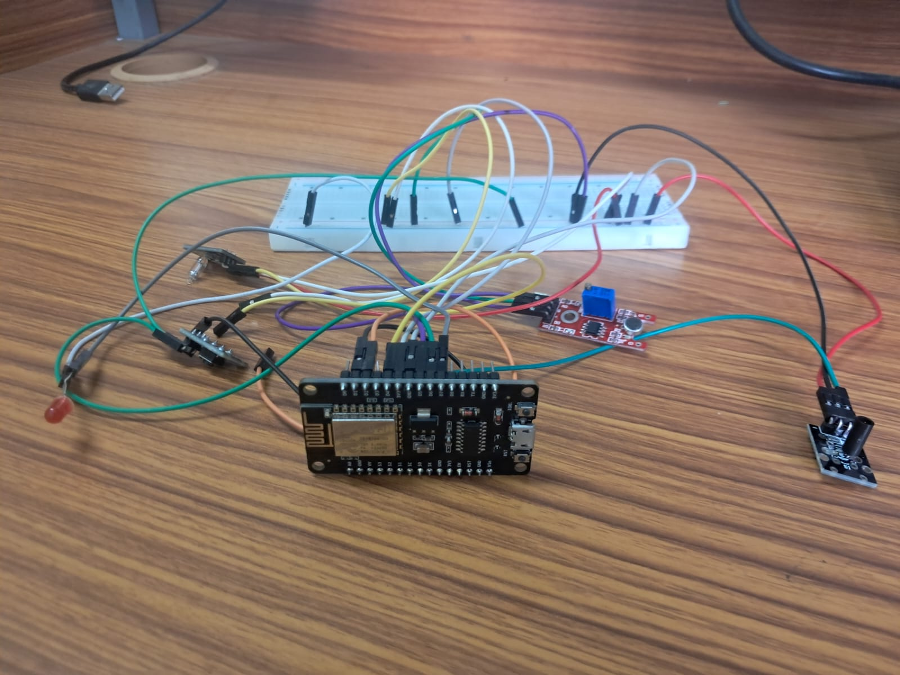
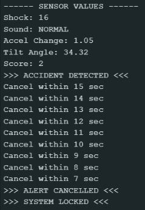
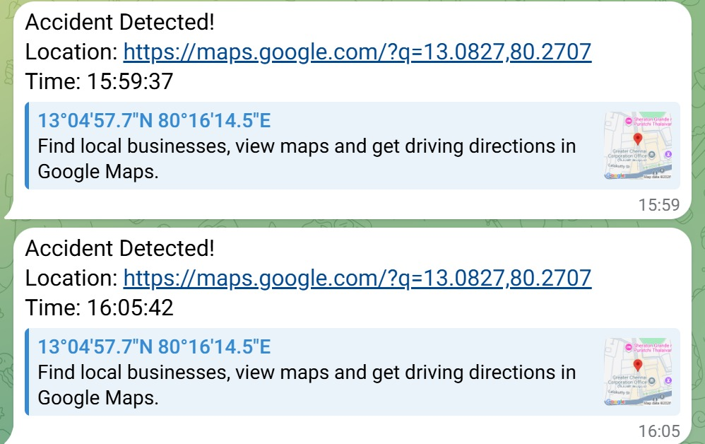

# 🚨 IoT-Based Intelligent Accident Detection and Emergency Response System

---

## 📌 Overview

Road accidents are a major cause of injuries and fatalities worldwide. A key reason for increased death rates is the delay in providing medical assistance. Victims are often unconscious or unable to call for help, and lack of accurate location details further delays emergency response.

This project presents an IoT-Based Intelligent Accident Detection System that automatically detects accidents using multiple sensors, verifies the event using intelligent logic, and sends emergency alerts with location details through the internet without human intervention.

---

## 🎯 Objectives

### 🔹 Main Objective

Improve road safety and reduce emergency response time.

### 🔹 Specific Objectives

* Automatically detect accidents using multiple sensors
* Accurately determine the accident location
* Provide a 10–15 second confirmation timer to prevent false alerts
* Automatically send emergency alerts if no user response is received
* Communicate quickly with emergency contacts
* Reduce fatalities by enabling faster medical response

---

## 📂 Problem Statement

Road accidents often become fatal because emergency help does not arrive on time. Victims may be unconscious or severely injured and unable to communicate. Manual reporting delays rescue operations.

### ❗ Challenges

* Delay in accident detection
* Lack of immediate communication
* No accurate location sharing
* Slow emergency response

### ✅ Solution

* Instant accident detection
* Multi-sensor verification
* Automatic alert system
* Real-time location sharing

---

## 🛠️ Components Required

### 💻 Software Components

| Component          | Description              |
| ------------------ | ------------------------ |
| C++ (Arduino IDE)  | Programming logic        |
| Arduino IDE        | Development platform     |
| ESP8266WiFi.h      | WiFi communication       |
| WiFiClientSecure.h | Secure API communication |
| time.h             | Timestamp generation     |
| Wire.h             | I2C communication        |
| MPU6050 Library    | Motion sensing           |
| Telegram Bot API   | Alert messaging          |

---

### 🔩 Hardware Components

| Component         | Description               |
| ----------------- | ------------------------- |
| ESP8266 (NodeMCU) | Main controller           |
| Shock Sensor      | Detects impact            |
| Sound Sensor      | Detects crash sound       |
| Tilt Sensor       | Detects rollover          |
| MPU6050           | Accelerometer + Gyroscope |
| Push Button       | Cancel alert              |
| LED Indicator     | Status indication         |
| Power Supply      | Provides power            |

---

## 📐 Architecture Diagram



---

## 📐 Flow Chart

```
Start
  ↓
Initialize Sensors & WiFi
  ↓
Read Sensor Values
  ↓
Check Accident Conditions
  ↓
Accident Detected?
 ├── No → Continue Monitoring
 └── Yes
        ↓
 Start 15-sec Timer + LED ON
        ↓
 Check Push Button
        ↓
 Button Pressed?
 ├── Yes → Cancel Alert
 └── No
        ↓
 Send Telegram Alert
        ↓
 Lock System Until Restart
        ↓
       End
```

---

## ⚙️ Working Model



---

## 🚗 Accident Detection and canceled the alert



---

## 📩 Alert System


---

## 🤖 Telegram Bot Integration



---

## 🚀 Features

* Multi-sensor accident detection
* Automatic alert system
* False alert prevention
* Real-time notification
* Location & timestamp sharing

---

## 📈 Future Enhancements

* GPS module integration
* Mobile application support
* Cloud storage integration
* AI-based prediction system

---

## 👨‍💻 Author

**Nandhakumar D**

---

## ⭐ Support

If you like this project, give it a ⭐ on GitHub!
